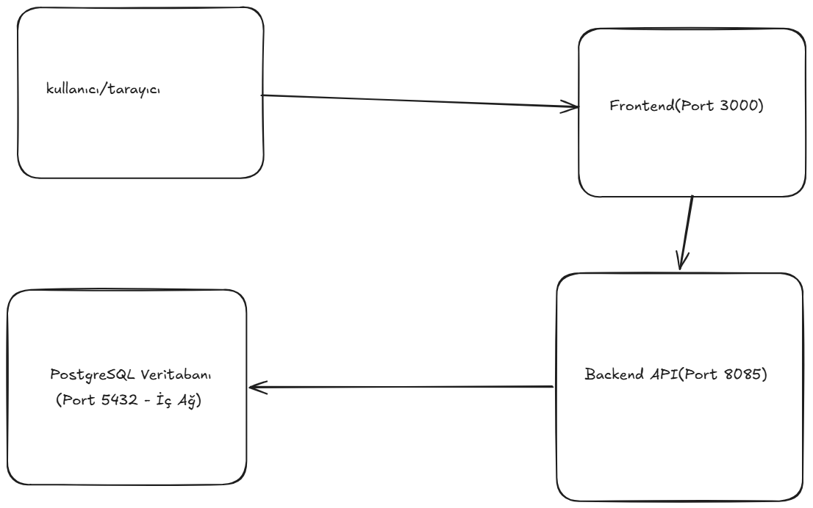

# UniSphere Deployment Topolojisi

Bu belge, UniSphere projesinin canlı sunucu (Production) üzerindeki Docker tabanlı ağ mimarisini, port yönlendirmelerini ve istek akışını açıklar. Sistem, güvenlik amacıyla izole edilmiş container'lar halinde çalışmaktadır.

## 1. Port Yapılandırması

### Dışarıya Açık Portlar (Public Ports)
Sunucuya dış dünyadan (tarayıcıdan veya dış sistemlerden) gelen HTTP isteklerini karşılayan portlardır:
* **Port 3000:** Frontend web arayüzüne erişim portu. (İstekler container içindeki Port 80'e yönlendirilir).
* **Port 8085:** Backend (C# API) servisine erişim portu. (İstekler container içindeki Port 8080'e yönlendirilir).

### Container İçi Portlar (Internal/Docker Network)
Güvenlik gereği dış dünyaya kapalı olan ve sadece Docker'ın kendi iç ağında (default bridge network) birbiriyle konuşan servisler:
* **Port 5432 (PostgreSQL):** `db` servisi. Dışarıdan erişime tamamen kapalıdır (Public port mapping iptal edilmiştir). Sadece `unisphere_api` container'ı bu veritabanına erişebilir.
* **Port 8080:** Backend API'nin container içindeki çalışma portu.
* **Port 80:** Frontend'in container içindeki çalışma portu.

## 2. İstek Akışı (Frontend → Backend → DB)
1. **İstemci (Client) Erişimi:** Kullanıcı tarayıcı üzerinden `http://[Sunucu_IP]:3000` adresine girerek React arayüzüne ulaşır.
2. **Frontend → Backend İletişimi:** Tarayıcıda çalışan Frontend uygulaması, veri okuma/yazma işlemleri için Backend'in dışarıya açık olan `http://[Sunucu_IP]:8085` (API) adresine istek atar.
3. **Backend → Veritabanı İletişimi:** Backend (`unisphere_api`), dışarıdan gelen isteği alır, işler ve Docker internal network üzerinden `db` isimli veritabanı container'ına (gizli `.env` değişkenlerindeki connection string ile) bağlanarak veri işlemini tamamlar.